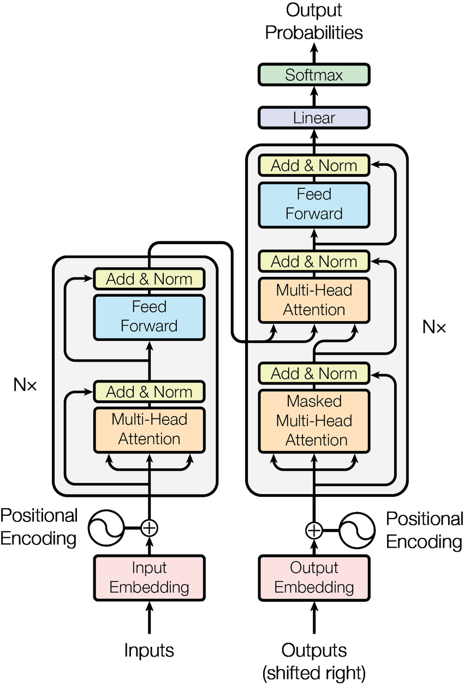
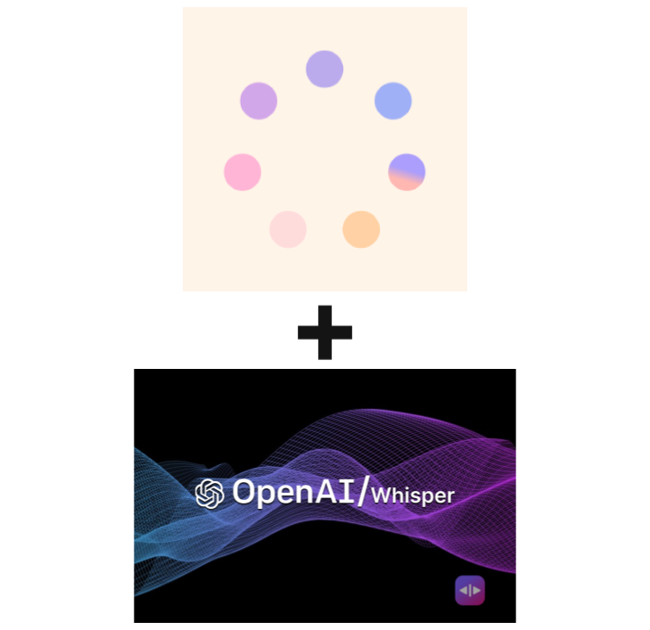
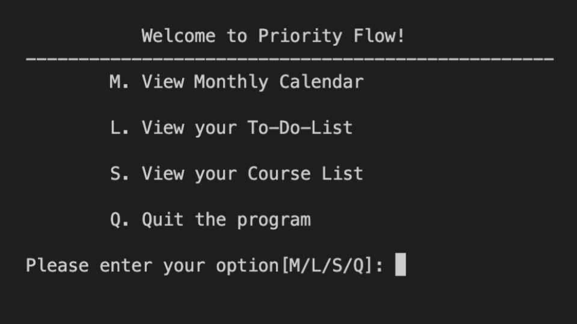

<html lang="en">
  <head>
    <meta charset="utf-8">
    <meta name="viewport" content="width=device-width, initial-scale=1, shrink-to-fit=no">
    <meta name="description" content="">
    <meta name="author" content="">
    <link rel="icon" href="/docs/4.0/assets/img/favicons/favicon.ico">
    <title>Projects for Bootstrap</title>
    <link rel="canonical" href="https://getbootstrap.com/docs/4.0/examples/album/">
    <!-- Include Bootstrap CSS -->
    <link rel="stylesheet" href="https://maxcdn.bootstrapcdn.com/bootstrap/4.0.0/css/bootstrap.min.css">
    <!-- Custom styles for this template -->
    <link href="styles.css" rel="stylesheet">
    
  </head>
  <body>
    <main role="main">
    <section id = "homepage" class="jumbotron text-center">
        
  
          <h1 id = "typewriter-text" class="jumbotron-heading">Jerry Li</h1>
          <h3 class="jumbotron-heading">UCR Undergraduate</h3>
          

            
            
            
            <!-- Add more social media images and links as needed -->
          

          
        

    </section>
    <section id = "about" class="jumbotron text-center">
        
  
          <h1 class="jumbotron-heading">About Me</h1>
          
Hello and welcome to my Profolio Website! I'm Jerry and I am currently a undergraduate student studying Computer Science at UCR. I am very interested in AI/ML, specifcally in NLP. I've also worked on other categories of Software Development such as Android App Development, Game Development, Web Development, and more recently some Blockchain. In my freetime I enjoy exercising (usually gym or tennis), watching movies with friends, and gaming.

        

    </section>
      <section id="research" class="jumbotron text-center hidden">
        
  
          <h1 class="jumbotron-heading">Research</h1>
          
I am currently conducting research at the <a href="https://cisl.ucr.edu">Collaborative Intelligence Systems Lab</a> (CISL) at UCR led by Dr. Qiu. Within CISL I am part of the perception team and I am currently working on two projects: Perception Module and Multimodal Perception.

          

            <a href="https://cisl.ucr.edu" class="btn btn-primary my-2">Link to Lab Website</a>
          

        

      </section>
      <section id = "projects" class="jumbotron text-center hidden">
        
  
          <h1 class="jumbotron-heading">Projects</h1>
          
Below are some of my ongoing and past projects.

          

            <a href="https://github.com/Jeli04" class="btn btn-primary my-2">Link to Github</a>
          

        

      </section>
      

        

          

            

              

                

                  
                

                

                  
I recreated a Transformer based on the famous paper "Attention Is All You Need" to translate English to Spanish using PyTorch.

                  

                    

                      <a href="https://github.com/Jeli04/transformer-translator" target="_blank">
                        <button type="button" class="btn btn-sm btn-outline-secondary">Github</button>
                      </a>
                    

                    <small class="text-muted">September 2023 - October 2023</small>
                  

                

              

            

            

              

                

                  
                

                

                  
Trained a Pytorch Neural Network to learn how to play TicTacToe using Reinforcement Learning and Monte Carlo Value Estimation.

                  

                    

                      <a href="https://github.com/Jeli04/TicTacToeNeuralNetwork" target="_blank">
                        <button type="button" class="btn btn-sm btn-outline-secondary">Github</button>
                      </a>
                    

                    <small class="text-muted">August 2023 - September 2023</small>
                  

                

              

            

            

              

                

                  
                

                

                  
I created a Chatbot that detects your emotion through a webcam using the Hume API and can listen to your voice using OpenAI's Whisper API.

                  

                    

                      <a href="https://github.com/Jeli04/Simple-Hume-Chatbot" target="_blank">
                        <button type="button" class="btn btn-sm btn-outline-secondary">Github</button>
                      </a>
                    

                    <small class="text-muted">July 2023</small>
                  

                

              

            

            

              

                

                  
                

                

                  
Using Git and C++, we created a Schedule Manager for our CS100 Final Group Project that represents everything we learned in our lower division CS classes.

                  

                    

                      <a href="https://github.com/Jeli04/CS100-Final-Project" target="_blank">
                        <button type="button" class="btn btn-sm btn-outline-secondary">Github</button>
                      </a>
                    

                    <small class="text-muted">March 2023 - June 2023</small>
                  

                

              

            

            

              

                
                

                  
This is a Social Anxiety Discorder Awareness Website created for my High School CS Pathway Capstone Project. We designed it through Figma and deployed a embedded Chatbot using Flask as our framework.

                  

                    

                      <button type="button" class="btn btn-sm btn-outline-secondary">View</button>
                      <button type="button" class="btn btn-sm btn-outline-secondary">Edit</button>
                    

                    <small class="text-muted">Janurary 2022 - June 2022</small>
                  

                

              

            

          

        

      

    <section id = "activities" class="jumbotron text-center">
      
  
        <h1 class="jumbotron-heading">Activities</h1>
        
Currently at UCR I am also part of two extracirricular activities on campus

      

      

        

          

            

              
I am currently Interning as a board member at <a href="https://acm.cs.ucr.edu">ACM@UCR</a>. My current responsibilites are planning General Meeting and other Events as well as leading a Build A MiniGPT workshop series for the Winter 2024 quarter.

              

                

                  <a href="https://github.com/Jeli04/transformer-translator" target="_blank">
                    <button type="button" class="btn btn-sm btn-outline-secondary">Github</button>
                  </a>
                

                <small class="text-muted">September 2023 - October 2023</small>
              

            

          

        

        

          

            

              
Trained a Pytorch Neural Network to learn how to play TicTacToe usingReinforcement Learning and Monte Carlo Value Estimation.

              

                

                  <a href="https://github.com/Jeli04/TicTacToeNeuralNetwork" target="_blank">
                    <button type="button" class="btn btn-sm btn-outline-secondary">Github</button>
                  </a>
                

                <small class="text-muted">August 2023 - September 2023</small>
              

            

          

        

      

    </section>
    </main>
    <footer class="text-muted">
      

        

          <a href="#">Back to top</a>
        

        
Album example is &copy; Bootstrap, but please download and customize it for yourself!

        
New to Bootstrap? <a href="../../">Visit the homepage</a> or read our <a href="../../getting-started/">getting started guide</a>.

      

    </footer>
    <!-- Bootstrap core JavaScript
    ================================================== -->
    <!-- Placed at the end of the document so the pages load faster -->
    
    
    
    
    
    
  </body>
</html>